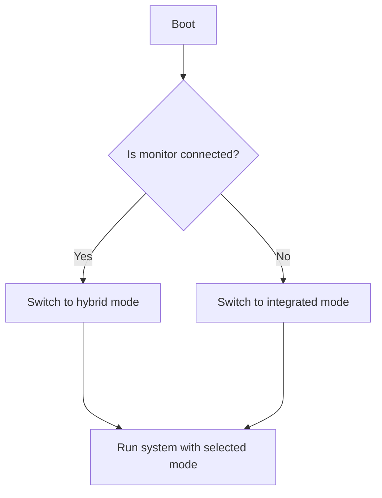

# NVIDIA integrated/hybrid mode switcher

## Requirements
- hwinfo

## Description
This script checkd at bootup if the monitor is connected.
If not, then it swich graphic mode to integrated, if else, then the mode is switched to hybrid.




To make this script as service copy the file to:
```
$ cp nvidia-integrated-hybrid_switcher.py /usr/local/bin/nvidia-integrated-hybrid_switcher.py
or
$ cp graphic_mode.sh /usr/local/bin/graphic_mode_switcher.sh

```

Make the script executable by running the following command:
```
$ chmod +x /usr/local/bin/nvidia-integrated-hybrid_switcher.py
or
$ chmod +x /usr/local/bin/graphic_mode_switcher.sh
```

Create new service file
```
$ nano /etc/systemd/system/graphic_mode_switcher.service
```

Paste follwing lines:
```
[Unit]
Description=graphic_mode_switcher
After=systemd-user-sessions.service plymouth-quit-wait.service
After=rc-local.service
Before=getty.target

[Service]
Type=oneshot
RemainAfterExit=yes
ExecStart=/usr/bin/python3 /usr/local/bin/graphic_mode_switcher.sh

[Install]
WantedBy=multi-user.target
```

Reload services deamon
```
$ systemctl daemon-reload
```
Enable service
```
$ systemctl enable graphic_mode_switcher.service
```
Start Service
```
$ systemctl start graphic_mode_switcher.service
```
